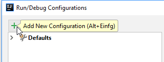
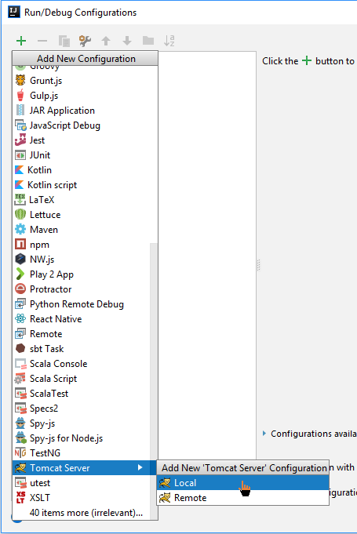
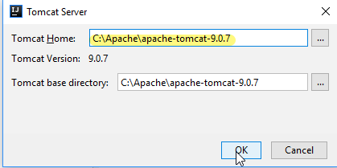
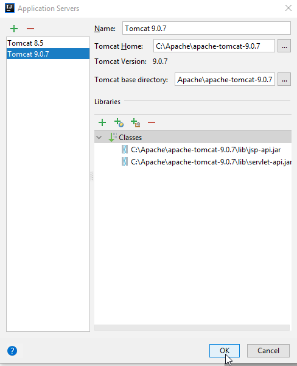
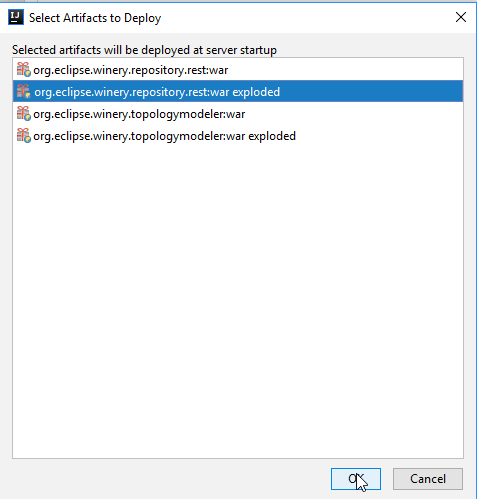
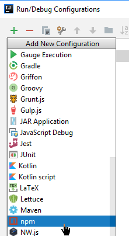
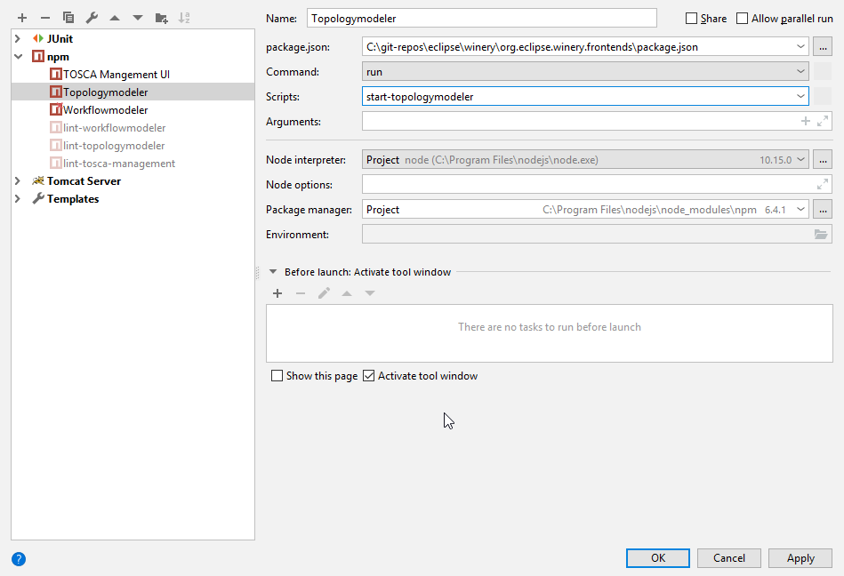

# IntelliJ Configuration

## Preparation: Install IntelliJ

1. Get a JetBrains Ultimate License. For students: Visit <https://www.jetbrains.com/student/>.
1. Install [JetBrains Toolbox](https://www.jetbrains.com/toolbox/): `choco install jetbrainstoolbox` and `choco pin add -n jetbrainstoolbox`, because JetBrains does an auto update
1. Install "IntelliJ IDEA Ultimate" using the JetBrains Toolbox.

## Preparation of the code

Generate a war to have all dependencies fetched by maven: `mvn package -DskipTests`.
This ensures that `Version.java` is generated and all node dependencies are fetched.
If this goes wrong at the first run, execute `mvn package -DskipTests` a second time.

## Setup of IntelliJ

1. At start of IntelliJ, browse to the root `pom.xml` and open it as project.
3. Enable checkstyle: Follow the shown steps and apply them in IntelliJ
  
  - Install the [IntelliJ Checkstyle Plugin](https://plugins.jetbrains.com/plugin/1065-checkstyle-idea).
    It can be found via plug-in repository (Settings -> Plugins -> Browse repositories)
  - Open the Settings (by pressing <kbd>Ctrl</kbd> + <kbd>Alt</kbd> + <kbd>S</kbd>)
  - Go to Other Settings -> CheckStyle.
  - Click on the green plus and add `checkstyle.xml` from the root of the Winery code repository.
4. Configure the code style (Source: <https://youtrack.jetbrains.com/issue/IDEA-61520#comment=27-1292600>)
    1. Open the Settings (by pressing <kbd>Ctrl</kbd> + <kbd>Alt</kbd> + <kbd>S</kbd>)
    3. Go to "Editor > Code Style"
    3. Click "Manage..." (right of "Scheme:")
    4. Click "Import Scheme"
    4. Choose "IntelliJ IDEA code style XML"
    5. Navigate to  `intellij-idea-code-style.xml`. It is located in `docs/dev/config/IntelliJ IDEA`
    6. Press "OK"
    6. You will see a message "Winery configuration settings were imported".
    7. Press "OK"
    8. Press "Close"
    9. Press "OK"
5. Setup code headers to be inserted automatically
    1. Open the Settings (by pressing <kbd>Ctrl</kbd> + <kbd>Alt</kbd> + <kbd>S</kbd>)
    2. Go to Editor > Copyright  > Copyright Profiles
    3. Click the green plus
    4. Name "Winery"
    5. Copyright text from [CodeHeaders](../../CodeHeaders.md)
    6. Go to Editor > Copyright > Formatting
    7. Adjust copyright formatting settings
       - Change to `Use block comments` with `Prefix each line`
       - Set `Relative Location` to `Before other comments`
       - Increase `Separator before/after Length` to `81`
       - 
    8. Go to Editor > Copyright
    9. Set "Winery" as Default project copyright
    10. Press "OK"
5. Configure Non-Null annotations properly  
   This is required for the [IntelliJ code inspections](https://www.jetbrains.com/help/idea/running-inspections.html) to run properly.
    1. Open the Settings (by pressing <kbd>Ctrl</kbd> + <kbd>Alt</kbd> + <kbd>S</kbd>)
    1. Search for "null"
    1. Go to "Build, Execution, Deployment"
    1. Go to "Compiler"
    1. Click on "Configure annotations..."
    1. At "Nullable annotations", click on the plus
    1. Search for `org.eclipse.jdt.annotation.Nullable`  
       
    1. Double click it
    1. At "NotNull annotations", click on the plus.
    1. Search for `org.eclipse.jdt.annotation.NonNull`  
       
    1. Double click it
    1. Click OK
    1. Click OK
6. Setup Apache Tomcat
    1. Download Tomcat 9.0 from <https://tomcat.apache.org/download-90.cgi>.
       Choose "zip" (E.g., <http://mirror.synyx.de/apache/tomcat/tomcat-9/v9.0.7/bin/apache-tomcat-9.0.7.zip>).
    1. Extract it to `C:\Apache`. Result: `C:\Apache\apache-tomcat-9.0.7`.
    1. 
    1. 
    1. 
    1. 
    1. 
    1. 
    1. Press OK  
       
    1. Set name and no browser launch: 
       
    1. Add deployment artifacts: 
       
    1. 
    1. 
    1. Set `/winery` as application context: 
       
    1. Click "Apply"
6. Setup npm run for Repository UI
    1. 
    1. 
6. Setup npm run for Topology modeler
    1. 
    1. 
6. Setup npm run for BPMN4TOSCA modeler
    1. 
    1. Choose `package.json` of "org.eclipse.winery.workflowmodeler"
    1. Use `ng` as script
    1. Use `serve` as arguments
6. Setup XSD validation for TOSCA files
    1. Open the Settings (by pressing <kbd>Ctrl</kbd> + <kbd>Alt</kbd> + <kbd>S</kbd>)
    1. Go to "Languages & Frameworks"
    1. Select "Schemas and DTDs"
    1. Click on the plus on the right at "External Schemas and DTDs"
    1. Enter `http://docs.oasis-open.org/tosca/ns/2011/12` as URI
    1. In "Project Schemas" search for `TOSCA-v1.0.xsd`.
       It should be located at "org.eclipse.winery.common".  
       In the case of opening `C:\winery-repository` in IntelliJ, you have to select enter `C:\git-repositories\winery\org.eclipse.winery.common\src\main\resources\TOSCA-v1.0.xsd` in the Field "File"
    1. Click "OK".
    1. Go to "Editor"
    1. Select "File Types"
    1. At "Recognized File Types", scroll down to XML
    1. Select "XML"
    1. At "Registered Patterns", click on the Plus
    1. Enter `*.tosca` in the popup.
    1. Click "OK"
    1. Click "OK"
6. Optional: In case you do not want to have the live-update of Angular, you build the wars of the UI and then deploy as follows:
    - External artifact `.../org.eclipse.winery.repository.ui/target/winery-ui.war` to `/`
    - External artifact `.../org.eclipse.winery.workflowmodeler/target/winery-workflowmodeler.war` to `/winery-workflowmodeler`
7. Get a JetBrains account and vote up following issues (at the right side, just click the thumbs-up next to "Voters". In case you don't see "Voters", reload the page):
  - <https://youtrack.jetbrains.com/issue/IDEA-195076>
  - <https://youtrack.jetbrains.com/issue/IDEA-147601>
  - <https://youtrack.jetbrains.com/issue/IDEA-142591>
  - <https://youtrack.jetbrains.com/issue/IDEA-176611>
  - <https://youtrack.jetbrains.com/issue/IDEA-75437>
  - <https://youtrack.jetbrains.com/issue/IDEA-159739>
  - <https://youtrack.jetbrains.com/issue/IDEA-131223>
8. Pros: Install the [Key Promoter X plugin](https://plugins.jetbrains.com/plugin/9792-key-promoter-x).
9. Run everything
  - Select "Winery - REST". Click on "Play" (the green rectangle)
  - Select "Repository UI". Click on "Play"
  - Select "Topolgoy Modeler". Click on "Play".
  - Open "http://localhost:4200" in your browser.
10. Demonstration: Open winery-repository (AKA tosca-definitions) in IntelliJ  
    This ensures that you can work with the TOSCA files using the IDE.
    1. Go to File -> Open...
    1. Enter `C:\winery-repository`
    1. Click "OK"
    1. At the dialog "Open Project" choose "New Window"
    1. Expand `winery-repository` (on the left side)
    1. Expand `nodetypes`
    1. Exapnd `http%3A%2F%2Fplain.winery.opentosca.org%2Fnodetypes`
    1. Expand `NodeTypeWithTwoKVProperties`
    1. Double click `NodeType.tosca`
    1. Go to line 14
    1. Type in `<`
    1. See that `<tosca:CapabilityDefinitions` and other `tosca` elements are proposed
    1. No further action required. You can close the window.

## Further Remarks

* Please let `.editorconfig` override the settings of IntelliJ
* Shortcuts
  - 2x <kbd>Shift</kbd> / <kbd>Ctrl</kbd>+<kbd>Shift</kbd>+<kbd>F</kbd> / <kbd>Ctrl</kbd>+<kbd>F</kbd>: Differrent forms of search
  - <kbd>Ctrl</kbd>+<kbd>Alt</kbd>+<kbd>L</kbd>: Organize imports (fixes checkstyle)
  - <kbd>Ctrl</kbd>+<kbd>X</kbd>: if nothing is marked: cut line (equal to marking whole line and using <kbd>Ctrl</kbd>+<kbd>X</kbd>)
  - <kbd>Ctrl</kbd>+<kbd>Shift</kbd>+<kbd>T</kbd>: Create/jump to the test class
* See [UpdateCopyrightHeaders](UpdateCopyrightHeaders.md) for updating old copyright headers

## License

Copyright (c) 2017-2018 Contributors to the Eclipse Foundation

See the NOTICE file(s) distributed with this work for additional
information regarding copyright ownership.

This program and the accompanying materials are made available under the
terms of the Eclipse Public License 2.0 which is available at
http://www.eclipse.org/legal/epl-2.0, or the Apache Software License 2.0
which is available at https://www.apache.org/licenses/LICENSE-2.0.

SPDX-License-Identifier: EPL-2.0 OR Apache-2.0
