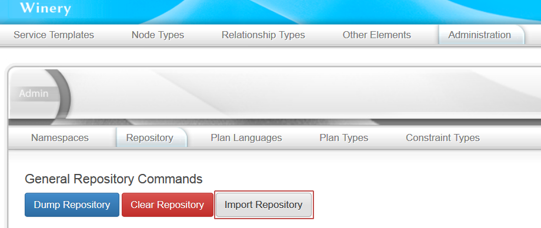
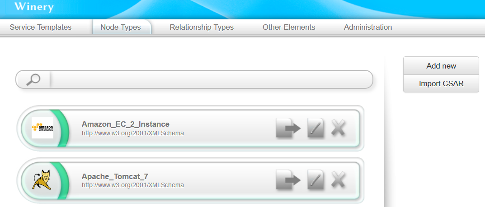
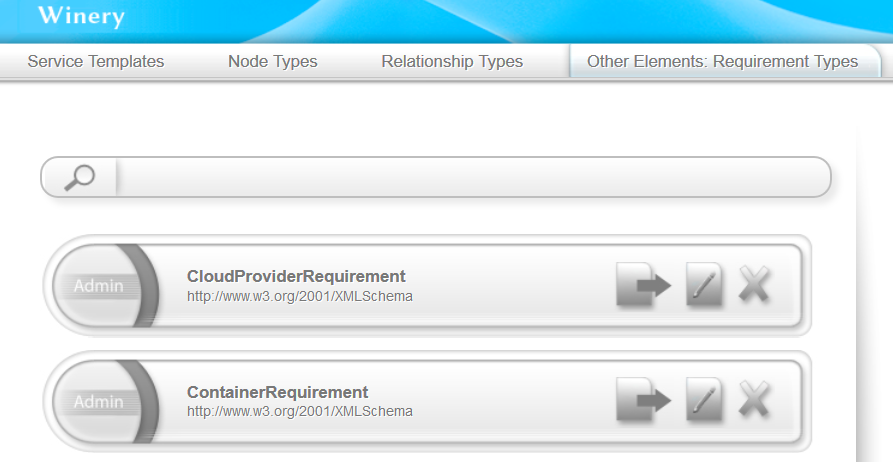
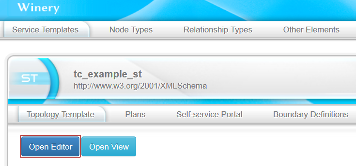
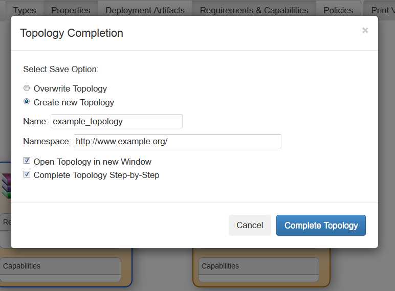
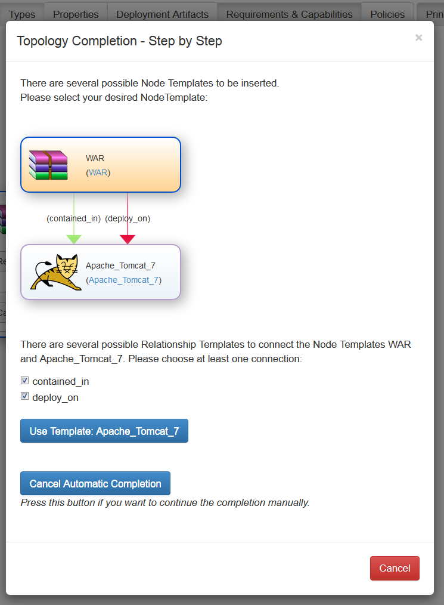

# TOSCA Topology Completion Tutorial

## Topology Completion - Getting started

Note: You should have a look at the [[Wienry User Guide]](http://eclipse.github.io/winery/UserGuide) before reading this tutorial to get all the basic knowledge about winery.

In this section we will give you a simple example on how to use the topology completion.
We will describe the required types in the repository and show you how to complete your first topology.

We will distinguish between two kinds of users, the Topology Modeler and the Repository Designer.
If you don't manage your own repository and just want to model and complete topologies based on a provided repository (e.g. by the employer) you can skip Step 3 and go straight to Step 4.
If you are a Repository Designer you should focus especially on the third step.

**Step 1:** Download the example repository available at https://wiki.eclipse.org/File:Tc_demo_repository.zip

**Step 2:** Import the repository in Winery (see next figure)

**Step 3:** Inspect the Types (Note: If you are not interested in the demo repository and just want to model and complete topologies, you can skip this step)

Let's have a look at the types modeled in the repository:

**Step 3.1:** Node Types

To inspect the Node Types of your Repository just select the tab "Node Types". You can get detailed information about the Node Types by clicking on them.
For this example we have created some Node Types you can use for the topology completion. As you can see, we created a WAR Node Type that can be used to deploy a web-based application, some middle-ware components (Apache Tomcat, Windows, Virtual Machine), a Cloud Provider Node Type and a Database with a corresponding Database Management System. For the topology completion, we will only have to model the application specific components (in this example the WAR, SQL Database and SQL DBMS Node Types).

When selecting the Node Type "WAR" you can see a more detailed view with information provided in tabs. Select the tab "RequirementDefinition" to display
the Requirements of this Node Type. As you can see, the WAR Node Type has the Requirement Definition "ContainerRequirement" determining that is has to be deployed in some kind of webserver container. This Requirement Definition will be considered by the Topology Completion. You can add further Requirements by yourself in this view. To do so you will have to create a new Requirement Type in the repository, see 3.2 for more informations. Note that a Node Type containing a suitable Capability Type should exist to satisfy your inserted Requirements.

If you inspect all Node Types of the demo repository you will see that a Node Type with a suitable Capability Definition exists for every Node Type with a Requirement Definition.

Now let's have a look at how Requirements and Capabilities are matched:

**Step 3.2:** Requirement and Capability Types

Select the tab "Other Elements" => "Requirement Types" to get to the overview of the contained Requirement Types in the Repository. As you can see we modeled
some Requirements in this example repository to be considered by the topology completion.

Now you can click on one of the Requirements to receive some more details. As you can see in the first tab, every Requirement Type contains an attribute "requiredCapabilityType" to determine which Capability Type matches the requirement. You can create Capability Types in the "Other Elements" overview and match them to you created Requirement Types.

**Step 3.3:** Relationship Types

To complete a topology correctly there also have to be Relationship Types defined in the Repository to connect newly inserted Node Templates to the
existent topology.

You can display the Relationship Types of the repository by selecting the "Relationship Types" tab. As you can see we inserted connections to connect all the Node Types in the repository. For every new Node Type you insert to the repository you should define a new Relationship Template. Alternatively you can define a generic Relationship Template (e.g. "deploy_on") setting the Valid Source and Valid Target elements to "all". However, those Relationship Types can't be used for the provisioning of an application so you have to define the connection in detail sooner or later.

**Step 4:**

Now that we gained an overview over the most important repository content we can start modeling and completing an example topology:

First we create a TOSCA Service Template by clicking on the "Service Templates" tab and selecting "Add new". There are already some namespaces provided you can choose from. Select a name and click on "Add" to create the Service Template. After that select the created Service Template and click on "Open Editor" in the
displayed window.

After that the graphical topology modeler of winery is opened. You should see the Node Types of the repository in the palette. Our goal is modeling only the application specific components and add the other components automatically. In this example we just model the Node Templates "WAR" and "SQLDatabase", do this by drag and dropping the Templates from the palette into the editor area. After that, select the modeled WAR Node Template, choose the SQLConnection and connect it with the SQL Database Node Template. Your modeled topology should look like this:

In the next step select "Requirements & Capabilities" in the toolbar to extend the Node Templates with the Requirement textfield. By clicking into this textfield
you are able to add a new Requirement. The Requirement Definition defined in the Node Type of the selected Template is already chosen, you just have to fill in an ID e.g. the requirement definition name. After adding the Requirements to both Node Templates your topology should look like this:

To invoke the topology completion select "Complete Topology" in the toolbar. After that the topology completion dialog is displayed. In this example we want to
create a new topology, opening it in a new window. Furthermore we want the topology completion to be displayed step-by-step:

By selecting "Complete Topology" the topology completion is invoked. Due to the selection of the step-by-step approach you will get feedback about the Node
and Relationship Templates that are inserted into the topology:

In this example, the repository only contains one Node Template that is able to fulfill the Requirement "ContainerRequirement" so only one possible Template is displayed. Note that you can cancel the automatic completion at any time, saving the current state and enabling you to make adjustments in the topology. Or you can reset the topology to the initial state, selecting the red "Cancel" button.

When selecting the "Use Template" button, the Node and Relationship Templates are added to the topology and the next step is displayed. So you should select the used Relationship Templates before pressing one of the buttons.

Keep choosing Node Templates until you receive a notification that the completion is successful. The completed topology is then displayed in a new browser window. Be aware that blocking pop-ups on the winery site will prevent opening a new browser tab. In that case you can access the completed topology through the repository. In case you don't select the Step-by-Step approach, the steps are hidden and the completed topology is displayed after a short time.

## License

Copyright (c) 2013-2017 University of Stuttgart.

All rights reserved. This program and the accompanying materials
are made available under the terms of the [Eclipse Public License v2.0]
and the [Apache License v2.0] which both accompany this distribution.

  [Apache License v2.0]: http://www.apache.org/licenses/LICENSE-2.0.html
  [Eclipse Public License v2.0]: http://www.eclipse.org/legal/epl-v20.html

Contributors:
  * Pascal Hirmer - initial API and implementation
